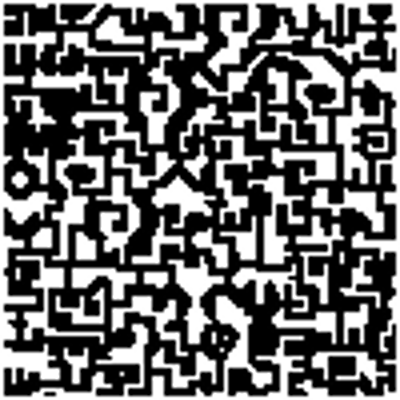
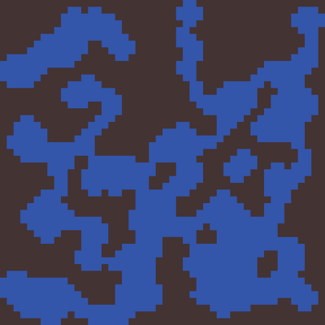
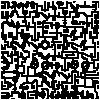
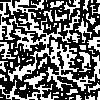
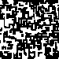

<!-- extends layout -->

<!--block content -->

# Procedural Dungeon Generation With Herringbone Tiles
## 05 Jan 2020
### Herringbone Tiles X Wave Function Collapse

I came across a [derivation of wang tiles](https://nothings.org/gamedev/herringbone/)# the other day, which immediately fascinated me. I've done procedural dungeon generation with cellular automata before, but this looked way cooler.

*fig 1. Herringbone Tiles*
 

*fig B. Cellular Automata*

Soon after that I saw this gif of the [wave function collapse algorithm](https://github.com/mxgmn/WaveFunctionCollapse)#.

*Wave Function Collapse in action*

Naturally I spent the better part of a week trying to get the two to play nice with each other, just to see what would happen. In my minds' eye I imaged that it would create organic looking structures of some kind, but for the most part I was just curious. If I could pull it off... it just might be cool. But, like most projects, there were some unexpected caveats and compromises to be made along the way.

#### Couldn't Compile, Made My Own

Sean Barrett, owner and propietor of the raw-html-a-palooza known as [nothings.com](http://nothings.org/)#, is the main resource I've found on the internet for herringbone tiles. They were designed by him to produce more interesting patterns with the added ability to color-code edge contraints for matching tiles right into the border of each tile. He wrote a library that could produce herringbone images for you, but it was in C and I've had little experience with actually compiling the language outside of uploading code to arduinos. It should have been as easy as "feeding an image into a file", but when I apt-got GCC with needed libraries it turned out it wasn't that simple. Generally scared, confused, and intimidated I opted to just create my own system in Node.js, in hopes that it might be useful for a fully interactive website of some kind later that dynamically generated a new dungeon to explore with each page refresh. 

Mr. Barrett created a set of herringbone tiles, which I lovingly used. 

*Separated into horizontal and vertical, arranged in a stair pattern*

I wasn't about to try and deal with the nonsensical overhead of trying to read in PNG buffers and splice together some image from there, I think I went with a slightly more big-brained approach. I gathered the necessary data needed from the tiles and organized by class (V/H) with row and column from the tilesheet into one massive JSON file. That way, lookup would be cheap and I wouldn't be loading images everytime I wanted to make a new map. Only downside was that I painstakingly had to extract each tile from the tile sheet as its own PNG. That only took 25-30 minutes, but it still sucked.

After that usable data was created, I just had to pipe that into a UInt8ClampedArray in RGBA format and then a library took care of the rest. I also stored the map structure itself as a 1-D array of 1's and 0's representing walls and floors, respectively.

#### Catching a Wave

I attempted to get the algorithm to work with a Javascript implementation but quickly realized that maybe this wasn't the right language for the job. And while I enjoy using JS, it's not exactly the most efficient of lanuages. I had to use a smaller input image for larger N's because my computer would lock up. Another one of the main CPU overheads is the image dimensions. 

In the end I got some pseudo-satisfying results. 

#### Results

It looks kind of cool, but WFC is designed to find patterns at the macro level with rather clear cut contraints, and for the most part it assumes that the flow of the image is grid-based. Herringbone tiles have a sort of wonky/ diagonal flow, so the output is rather jagged. 

*Test image generated by me*

*One of the generated WFC images n = 3*

n, the variable that creates the most CPU overhead, specifies the region size in pixels it is looking for patterns in. I got better results with n=4 (my 8GB of ram laptop crashed even when I gave Node.js 6GB). I capped it at 6GB because even with that much it took forever and I thought my computer was going to crash. Good rule of thumb is to never delegate all of your available memory to a running process. The OS needs memory too, ya know.

*Test image generated by me*

*One of the generated WFC images n = 4*

I could run more tests with a higher n, but I feel like I found my answer. I'm more satisfied/ interested in a pure herringbone tile approach for dungeons. WFC provides some interesting features, but the loss in structure doesn't make for a navigable space that stays interesting. I will keep WFC in mind when I am dealing with specified tilesets that are of uniform dimensions, though. That's where it really shines as an algorithm. Plenty of games/ tools have really shone using the algorithm, and procedurally generating large spaces looks very satisfying - more so than any other procedural generation method I've found. Things like Marching Cubes, Ray Marching, etc. thrive with a lack of structure. But introducing constraints can create some seemingly intelligent designs.

*Oskar Stalberg, my introduction to WFC*

In the mean time, I was going to try and use React to make some kind of playable game with my map data, but I'm having some trouble getting that up and running. I'm also toying with the idea of redoing a large portion of this website in React, but I'm unsure. Could be good excercise, but I think I would rather build something from the ground up than replace what I have here. Plus, I've grown rather attached and this is a personal website, so I think I'm allowed some comfort.

UPDATE:

I got something working in React, but the game-specific framework I was using was fairly limited. I opted to continue my project in Java, since I already had a game engine I'd been building and just needed a base game to flesh some more stuff out. Some updates on that if I can get shaders/ rooms nice.