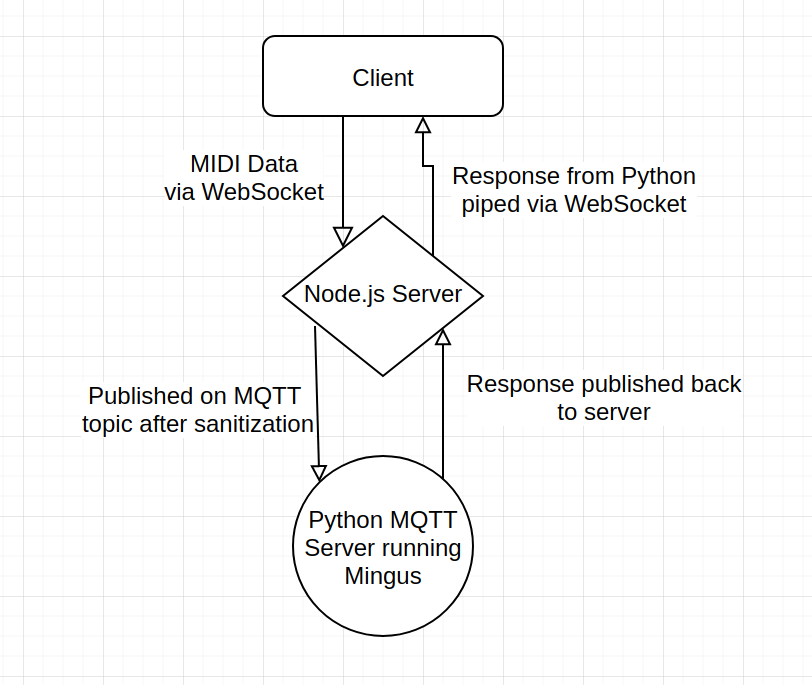

<!-- extends layout -->

<!--block content -->

# Midi Chord Detection
## 13 Feb 2020
### WebSockets and MQTT and Disappointing Libraries, Oh My!

So one of my main passions/ hobbies in life is composing music (as evident by my inclusion of my music page on this website). But part of what thrills me about creating music is partly what thrills me about software engineering and coding in general. It's this beautiful marriage of engineering and creativity, where you can choose to emphasize either one or the other to varying degrees of success. Music, like most disciplines, can be backed up by more theory than you shake a stick at, and over time I have tried to learn as much as I can about it in order to better create my pieces. Something as "simple" as chord detection is actually fairly complex. I've tried various libraries and come to the conclusion that the javascript ecosystem is just not there yet in terms of robustness. Chord inversions completely threw every one of them for a loop for whatever reason. I think it's because of how they though about chords in the first place. Technically, a chord should always be derived from a known mode with a fixed set of intervals depending on what degree of the scale you are using. Focusing on those intervals and not paying attention to the underlying modal structure leads to a lot of heavy lifting that could be avoided just be paying more attention to the fundamentals. 

It's akin to seeing the forest for the trees. 

Eventually I found a very powerful and mostly accurate library written in python called [mingus](https://bspaans.github.io/python-mingus/)#. Now the issue came with somehow using this in my application. My idea was as follows:

I got this working eventually - most of the heavy lifting was just in getting the networking right on AWS and having the websockets play nice. You can view source [here](https://github.com/mathaou/showcase)#. View the finished product [here](https://www.mfarstad.com/zodd)#. 

For the future, I would like to be able to select one of the displayed chords and have it be shown on an actual staff. You can then choose alternate voicings maximizing specific intervals (5ths, 3rds, 4ths etc.) and then add to a "progression". The progression will be displayed at the bottom of the page and can be played on loop with a list of optional samples + BPM. The next-next step after that would be incorporating ABC notation in the browser and allowing people to modify/ write their scores as they please. So for now, I'll try getting it to work with whole notes.